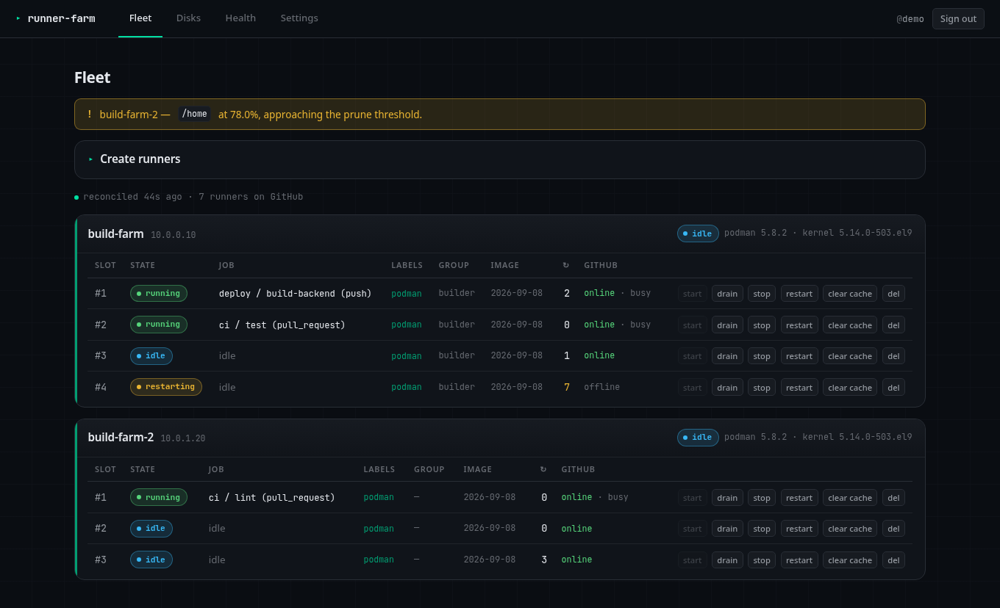
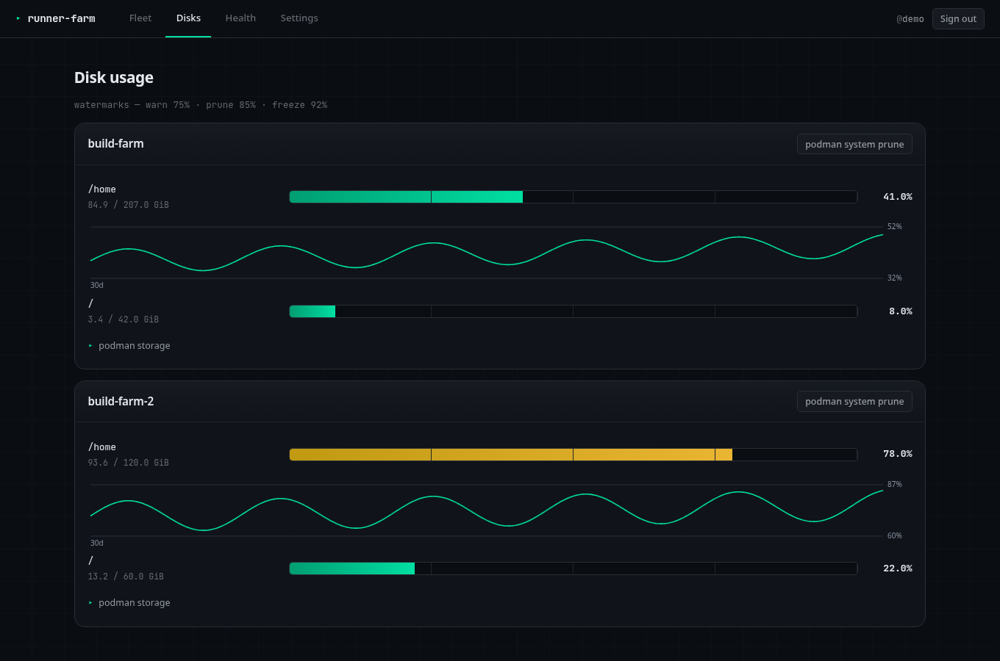
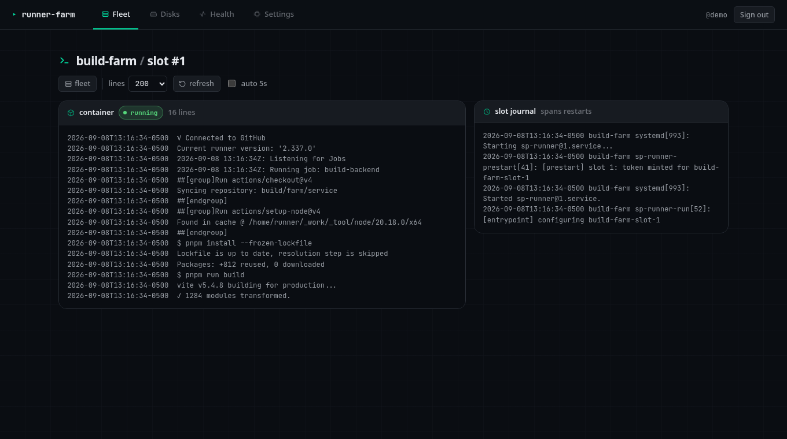

# ephemeral-runner-farm

Self-hosted GitHub Actions runners that run as **ephemeral rootless Podman
containers** — one job per container, container destroyed afterwards — plus a
small web UI to manage the fleet and watch disk usage.

The design makes two chronic self-hosted-runner problems structurally
impossible:

- **No accumulation.** `_work` and `_diag` live inside a `--rm` container. Only
  two named cache volumes (a per-slot tool cache and a shared pnpm store)
  survive a job, and both are bounded and prunable from the UI.
- **Self-healing.** Every exit path — job finished, job crashed, OOM kill, host
  reboot — is identical to systemd: start a fresh container. `Restart=always`
  plus `loginctl enable-linger`.

It runs entirely as one **unprivileged** user in its own `systemd --user`
manager: no root daemon, no sudoers rules. Root is used only by
`host/setup-host.sh` at install time and by the optional `migration/` scripts.

Multiple hosts feed the same runner group, so GitHub schedules across them and
no single host is a build-blocking point of failure.

## Screenshots

**Fleet** — every slot on every host, live job, restart count, GitHub registration:



**Disks** — per-mount gauges with watermark colouring and a 30-day sparkline:



**Logs** — last _n_ lines of a slot's current job container plus its systemd
journal (which spans restarts), with auto-refresh:



Try the UI with no hosts and synthetic data:

```bash
python3 -m venv .venv && .venv/bin/pip install -r manager/requirements.txt
cat > /tmp/m.toml <<'EOF'
[server]
secret_key = "change-me-000000000000000000000000000000000000000000"
[github]
org = "demo"
app_id = 0
installation_id = 0
private_key_file = "/tmp/none.pem"
[[hosts]]
id = "build-farm"
address = "127.0.0.1"
agent_url = "https://127.0.0.1:8181"
agent_token = "a"
manager_token = "b"
agent_tls_fingerprint = "x"
enabled = true
[[hosts]]
id = "build-farm-2"
address = "10.0.1.20"
agent_url = "https://10.0.1.20:8181"
agent_token = "c"
manager_token = "d"
agent_tls_fingerprint = "y"
enabled = true
EOF
FARM_DEMO=1 FARM_MANAGER_CONFIG=/tmp/m.toml STATE_DIRECTORY=/tmp/farm-demo \
  .venv/bin/python -m uvicorn --app-dir manager app:app --port 8080
# open http://localhost:8080  (demo mode skips auth)
```

## How it fits together

| Path | What | Where it runs |
|---|---|---|
| `containerfile/` | the ephemeral runner image (`localhost/sp-runner`) | built on every host |
| `host/` | `systemd --user` units, the slot lifecycle scripts, `setup-host.sh` | every host |
| `agent/` | a small FastAPI service — the only thing that touches a host's systemd/podman | every host, `:8181` (HTTPS, self-signed + pinned) |
| `manager/` | FastAPI web UI + GitHub App token minting + reconcile/disk loops | one host, `:8080` |
| `migration/` | optional one-shot scripts to move off an existing bare-metal setup | any host |
| `deploy.sh` | idempotent installer over SSH | your workstation |

See [docs/ARCHITECTURE.md](docs/ARCHITECTURE.md) for the full design and
[docs/DEPLOYMENT.md](docs/DEPLOYMENT.md) for a step-by-step install.

## Requirements

**Hosts** — Linux with cgroups v2 (Rocky/RHEL/Alma 9+, recent Fedora/Debian/Ubuntu):
podman ≥ 4.x, `crun`, `fuse-overlayfs`, `passt`/`pasta`, Python ≥ 3.11, systemd
with user lingering, outbound access to Docker Hub and an Ubuntu mirror.
`setup-host.sh` installs the packages.

**Workstation** — `bash`, `ssh`, `rsync`, `python3` (3.9+), `openssl`, and SSH
key access with sudo to each host.

**GitHub** — a GitHub App on your org (or user) with
*Organization → Self-hosted runners: Read and write*
(optionally *Administration: Read-only* for runner-group names).

## Quick start

```bash
cp hosts.toml.example hosts.toml     # ssh targets + roles
$EDITOR hosts.toml

./deploy.sh init                     # generates secrets/ (tokens, cookie key, per-host configs)
$EDITOR secrets/manager.toml         # fill [github] app_id + installation_id
cp /path/to/app-private-key.pem secrets/github-app.pem

./deploy.sh push <manager-host-id>   # installs manager + agent, prints the seed admin password
./deploy.sh push <other-host-id>     # each additional host: agent only
```

Then open `http://<manager-host>:8080`, sign in as `admin` with the printed
password, and change it under **Settings**.

## Using the UI

- **Fleet** — every slot on every host: state, current job, restart count,
  GitHub registration status. Per slot: start · **drain** (stop after the
  current job) · stop (now) · restart · clear cache · delete. "Create runners"
  makes N slots on a host with chosen labels, group, and resource limits.
- **Disks** — per-host gauges for every mount, `podman system df` breakdown, a
  30-day usage sparkline, and a prune button.
- **Health** — host reachability, an orphan reaper (offline GitHub runners with
  no live container), and the audit log.
- **Settings** — password, GitHub App token status, runner groups, host list.

## Disk watermarks

Act on the used-percent of each host's first configured mount (normally `/home`):

| level | default | effect |
|---|---|---|
| warn | 75% | UI banner |
| prune | 85% | auto `podman system prune` + clear idle-slot tool caches |
| freeze | 92% | block creating/starting slots on that host until space is freed |

Tune in `manager.toml [watermarks]`.

## Moving off an existing bare-metal setup

`migration/` has optional, self-discovering, dry-run-by-default helpers:

```bash
sudo migration/00-backup.sh                        # snapshot units, .runner/.credentials, LVM metadata
sudo migration/02-retire-bare-metal.sh --apply     # remove old runner units + accounts + stale binaries
sudo GH_TOKEN=… migration/03-retire-runner.sh <account> --apply   # deregister one runner cleanly, after draining
```

`migration/01-reclaim-swap.sh` and `grow-home.sh` help free / grow the
runner-data filesystem on the common Rocky LVM layout.

## Extending it — API, events, plugins

The manager exposes a stable surface so you don't have to fork the core:

- **`/api/v1/*`** JSON (key-auth) — `summary`, `fleet`, `hosts`, `disks`,
  `events`, slot control. `GET /api/v1/summary` is a one-poll health rollup.
  See [docs/API.md](docs/API.md).
- **`/metrics`** — Prometheus text exposition for Grafana (`prometheus` plugin).
- **Event hub** — core emits `host.degraded` / `host.recovered` / `disk.freeze`
  / `slot.offline` / `slot.crashloop` … on state transitions. Plugins subscribe;
  events are also stored and shown on the Health page.
- **Plugins** — a Python module with `def setup(hub, config)`; hook events, add
  routes, add metrics. Two bundled: `webhook` (POST events to ntfy / Pushover /
  Slack / anything — this is your phone notification) and `prometheus`. See
  [docs/PLUGINS.md](docs/PLUGINS.md).

```toml
[plugins]
enabled = ["webhook", "prometheus"]

[plugins.webhook]
[[plugins.webhook.targets]]
url    = "https://ntfy.sh/YOUR-TOPIC"
events = ["host.degraded", "host.recovered", "disk.freeze", "slot.crashloop"]
format = "ntfy"
```

## Known limitations

- **The UI is plain HTTP.** Fine on a trusted LAN. To harden, put the manager
  behind a TLS reverse proxy, set `server.secure_cookies = true`, and point the
  remote agents' `manager_url` at the proxy with `verify_tls`.
- **Container jobs / `services:` in workflows** need a container runtime inside
  the runner image (Docker-in-Podman). The image doesn't ship one; add it if
  your workflows use them.
- **`deploy.sh` needs SSH key auth with sudo** — it never accepts a password on
  the command line.

## License

MIT — see [LICENSE](LICENSE).
